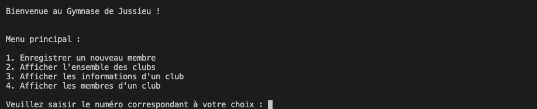

<h2>Gestionnaire de tâches</h2>

C'est une application Java consistant en un gestionnaire de tâches administratives au sein d’un gymnase, un projet universitaire réalisé avec <a href = "https://fr.linkedin.com/in/sarah-habbi-1a2ba81a4">Sarah Habbi</a>, au premier semestre de la deuxième année de licence informatique à <a href = "https://sciences.sorbonne-universite.fr">Sorbonne Université</a>.

<h3>Fonctionnalitées</h3>

</img>

<h3>Organisation du projet</h3>

Vous trouverez le sujet du projet dans le fichier projet.pdf, et le rapport de réalisations dans le fichier rapport.pdf

Vous avez toutes les codes sources des classes dans le dossier src, les classes compilées dans le dossier bin. La documentation format web 
dans le dossier doc.

<h3 >Tester l'application</h3>

Vous pouvez tester l'appli en téléchargeant le zip, en vous plaçant dans le dossier bin grâce à un Terminal et en exécutant la commande : "java GymnaseApp".

Il faut bien sûr avoir le JDK d'installé au préalable.
